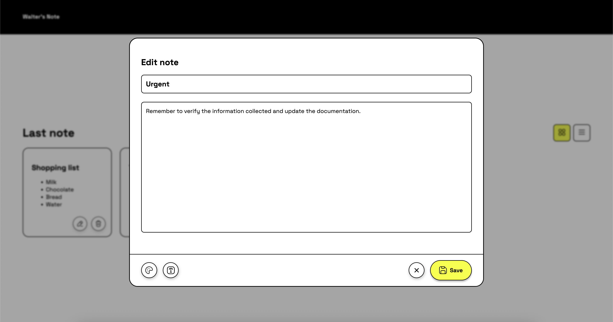

SUPSI 2025-26 
Creative Coding 
Marco Lurati, Giovanni Profeta 
Assignments 01

# Pinboard
Author: Walter De Nicola 
[Pinboard sito](https://walterdenicolapersonale.github.io/MAInD-Creative-Coding-Foundations-2025/assignments/assignments%2001/) 

## Brief
Starting from the concept of a pinboard, implement a web page that:

- is responsive (properly layout for smartphone, tablet, and desktop)
- allows the user to add and remove elements
- allows the user to coustomize elements (i.e. colors, size)
- allows the switch between two views (at least)

## Screenshot

## Project description
PinBoard is an interactive web app for creating, editing, and managing notes. Users can choose between grid or list view, change colours, edit text, and delete or restore notes via modal. The interface is responsive and adapted for mobile devices.

## Function

| Function Name        | Arguments | Description | Returns |
|---------------------|-----------|-------------|---------|
| `updateCategoryView()` | None      | Controls which notes are displayed based on the selected category (“Note” or “Trash”). It also updates UI elements accordingly: changes header text, toggles visibility of the “Add note” button and the view mode controls, and adds/removes the “Restore” button for items in the trash. | `void` |

Most of the application's interactive behavior (creating notes, editing notes, deleting/restoring them, switching layout view, changing text size, and choosing colors) is handled through click event listeners.
 

### Event Handlers (Implicit Functions)

| Handler / Logic Name | Trigger | Description | Returns |
|---------------------|---------|-------------|---------|
| **Switch to Grid View** | `btnGrid.addEventListener('click')` | Switches the note layout to grid mode by toggling CSS classes. Calls `updateCategoryView()` to ensure proper display. | `void` |
| **Switch to List View** | `btnList.addEventListener('click')` | Switches the note layout to list mode by toggling CSS classes. Calls `updateCategoryView()`. | `void` |
| **Category Switch** | `categoryButtons.forEach(... addEventListener('click'))` | Changes active category between "Note" and "Trash", triggering a UI refresh using `updateCategoryView()`. | `void` |
| **Open Edit Modal** | `document.addEventListener('click', (e => e.target.closest('.card-action-btn[data-action="edit"]')))` | Opens the note editor with content pre-filled from the selected card. | `void` |
| **Move Note to Trash** | `document.addEventListener('click', [... data-action="delete"])` | Sets note category to `"trash"` and refreshes the note list. | `void` |
| **Restore Note** | `document.addEventListener('click', [... data-action="restore"])` | Moves a deleted note back to `"note"` and updates view. | `void` |
| **Open Create Modal** | `document.addEventListener('click', [... add-card])` | Opens the modal in "create" mode with empty fields and default text formatting. | `void` |
| **Save Note** | `document.addEventListener('click', [... note-save])` | Saves a new or edited note: updates title, text items (list or paragraph), text sizes, and background color. | `void` |
| **Close Modal** | `document.addEventListener('click', [... note-delete or modal-overlay])` | Closes the editor and clears editing state without saving changes. | `void` |
 

### Styling / Formatting Controls

| Feature Name | UI Trigger | Description | Returns |
|-------------|-----------|-------------|---------|
| **Toggle Color Picker** | `color-btn.addEventListener('click')` | Shows / hides the color selection menu. | `void` |
| **Apply Predefined Color** | `document.addEventListener('click', (e => e.target.closest('.color-option')))` | Applies selected color to note preview. | `void` |
| **Custom Color Input** | `custom-color-picker.addEventListener('input')` | Applies chosen custom color to note preview. | `void` |
| **Toggle Text Size Menu** | `text-btn.addEventListener('click')` | Shows / hides the text size controls. | `void` |
| **Adjust Text Size** | `document.addEventListener('click', [... text-size-option])` | Increases or decreases title and body font size inside the editor. | `void` |

