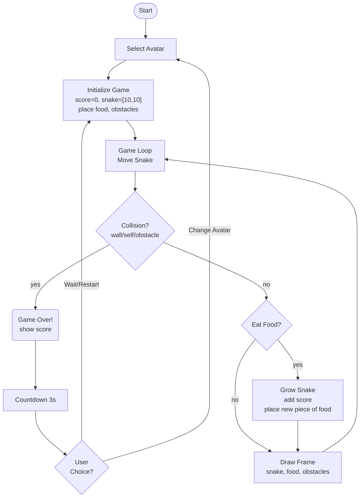

SUPSI 2025-26 
Creative Coding 
Marco Lurati, Giovanni Profeta 
Assignments 01

# Snake The Game
Author: Walter De Nicola 
[Pinboard sito](https://walterdenicolapersonale.github.io/MAInD-Creative-Coding-Foundations-2025/assignments/assignments%2001/) 

## Brief
Choose a “mini-game” to rebuild with HTML, CSS and JavaScript. The requirements are:

- The webpage should be responsive
- Choose an avatar at the beginning of the game
- Keep track of the score of the player
- Use the keyboard to control the game (indicate what are the controls in the page). You can also use buttons (mouse), but also keyboard.
- Use some multimedia files (audio, video, …)
- Implement an “automatic restart” in the game (that is not done via the refresh of the page)

## Project description
The game is directly inspired by Snake, recreating its arcade-style atmosphere. At the beginning, the user can choose an avatar, each with a special ability: standard speed, fast mode (which progressively increases speed), double points (which doubles the score obtained) and colour shift (which changes colour during the game). The user can also activate or deactivate the audio by clicking on the appropriate button.

The player can move the snake up, down, right or left using the arrow keys on the keyboard. The goal is to grow as much as possible by eating apples and avoiding obstacles along the way and touching your tail. Each apple collected increases your score.

If the snake touches an obstacle or its tail, the game ends and the Game Over screen appears. From here, the user can choose to restart the game or change avatars. Alternatively, after 3 seconds, the game restarts automatically.

## Screenshot

## Flowchart

## Function

| Function Name        | Arguments | Description | Returns |
|---------------------|-----------|-------------|---------|
| `updateCategoryView()` | None      | Controls which notes are displayed based on the selected category (“Note” or “Trash”). It also updates UI elements accordingly: changes header text, toggles visibility of the “Add note” button and the view mode controls, and adds/removes the “Restore” button for items in the trash. | `void` |

Most of the application's interactive behavior (creating notes, editing notes, deleting/restoring them, switching layout view, changing text size, and choosing colors) is handled through click event listeners.
 

### Event Handlers (Implicit Functions)

| Handler / Logic Name | Trigger | Description | Returns |
|---------------------|---------|-------------|---------|
| **Switch to Grid View** | `btnGrid.addEventListener('click')` | Switches the note layout to grid mode by toggling CSS classes. Calls `updateCategoryView()` to ensure proper display. | `void` |
| **Switch to List View** | `btnList.addEventListener('click')` | Switches the note layout to list mode by toggling CSS classes. Calls `updateCategoryView()`. | `void` |
| **Category Switch** | `categoryButtons.forEach(... addEventListener('click'))` | Changes active category between "Note" and "Trash", triggering a UI refresh using `updateCategoryView()`. | `void` |
| **Open Edit Modal** | `document.addEventListener('click', (e => e.target.closest('.card-action-btn[data-action="edit"]')))` | Opens the note editor with content pre-filled from the selected card. | `void` |
| **Move Note to Trash** | `document.addEventListener('click', [... data-action="delete"])` | Sets note category to `"trash"` and refreshes the note list. | `void` |
| **Restore Note** | `document.addEventListener('click', [... data-action="restore"])` | Moves a deleted note back to `"note"` and updates view. | `void` |
| **Open Create Modal** | `document.addEventListener('click', [... add-card])` | Opens the modal in "create" mode with empty fields and default text formatting. | `void` |
| **Save Note** | `document.addEventListener('click', [... note-save])` | Saves a new or edited note: updates title, text items (list or paragraph), text sizes, and background color. | `void` |
| **Close Modal** | `document.addEventListener('click', [... note-delete or modal-overlay])` | Closes the editor and clears editing state without saving changes. | `void` |
 

### Styling / Formatting Controls

| Feature Name | UI Trigger | Description | Returns |
|-------------|-----------|-------------|---------|
| **Toggle Color Picker** | `color-btn.addEventListener('click')` | Shows / hides the color selection menu. | `void` |
| **Apply Predefined Color** | `document.addEventListener('click', (e => e.target.closest('.color-option')))` | Applies selected color to note preview. | `void` |
| **Custom Color Input** | `custom-color-picker.addEventListener('input')` | Applies chosen custom color to note preview. | `void` |
| **Toggle Text Size Menu** | `text-btn.addEventListener('click')` | Shows / hides the text size controls. | `void` |
| **Adjust Text Size** | `document.addEventListener('click', [... text-size-option])` | Increases or decreases title and body font size inside the editor. | `void` |

