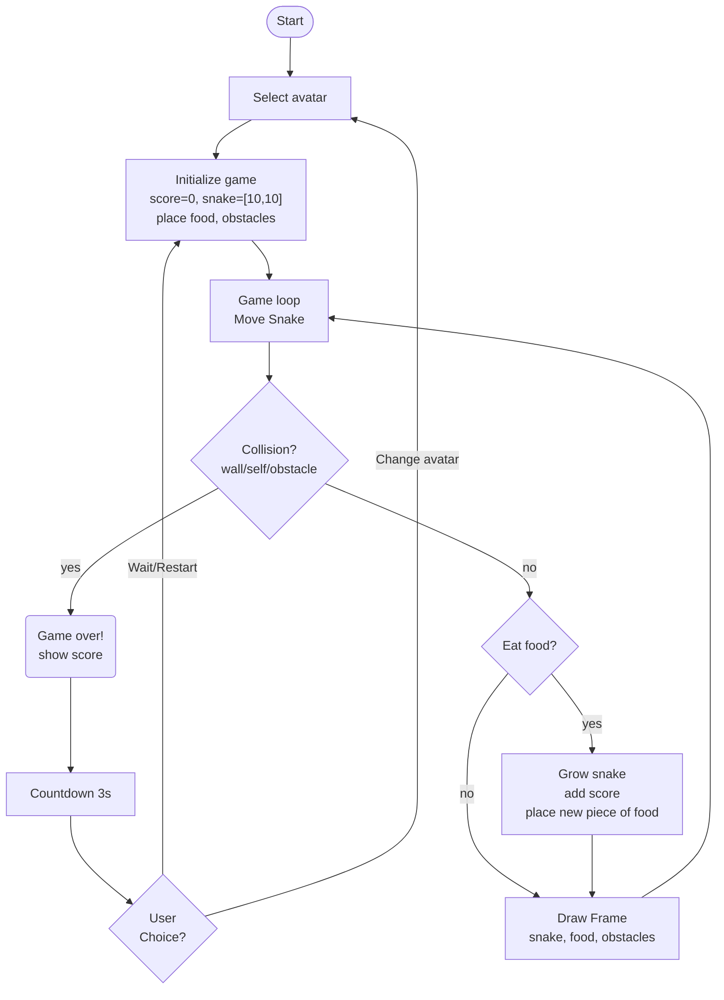

SUPSI 2025-26 
Creative Coding 
Marco Lurati, Giovanni Profeta 
Assignments 02

# Snake The Game
Author: Walter De Nicola 
[Snake The Game](https://walterdn03.github.io/MAInD-Creative-Coding-Foundations-2025/assignments/assignments%2002/) 

## Brief
Choose a “mini-game” to rebuild with HTML, CSS and JavaScript. The requirements are:

- The webpage should be responsive
- Choose an avatar at the beginning of the game
- Keep track of the score of the player
- Use the keyboard to control the game (indicate what are the controls in the page). You can also use buttons (mouse), but also keyboard.
- Use some multimedia files (audio, video, …)
- Implement an “automatic restart” in the game (that is not done via the refresh of the page)

## Project description
The game is directly inspired by the classic game snake, recreating its arcade-style atmosphere. At the beginning, the user can choose an avatar, each with a special ability: standard speed, fast mode (which progressively increases speed), double points (which doubles the score obtained) and colour shift (which changes colour during the game). The user can also activate or deactivate the audio by clicking on the appropriate button.

The player can move the snake up, down, right or left using the arrow keys on the keyboard. The goal is to grow as much as possible by eating apples and avoiding obstacles along the way and touching your tail. Each apple collected increases your score.

If the snake touches an obstacle or its tail, the game ends and the game over screen appears. From here, the user can choose to restart the game or change avatars. Alternatively, after 3 seconds, the game restarts automatically.

## Screenshot

## Flowchart

## Function

### playBackgroundMusic()

**Parameters** none

**Return** none

Checks if the global isMusicMuted variable is false. If so, it triggers the backgroundMusic.play() method.

---

### stopBackgroundMusic()

**Parameters:** None

**Return:** None

Pauses the background music audio object and resets its currentTime property to 0, ensuring the track starts from the beginning next time.

---

### toggleMusic()

**Parameters:** None

**Return:** None

Toggles the isMusicMuted boolean state. It updates the DOM element (the music toggle button) text and CSS class. Depending on the new state, it calls either stopBackgroundMusic() or playBackgroundMusic() (if a game is active).

---

### playEatSound()

**Parameters:** None

**Return:** None

Resets the eatSound audio time to 0 and plays the sound effect. Called when the snake consumes food.

---

### playGameOverSound()

**Parameters:** None

**Return:** None

Resets the gameOverSound audio time to 0 and plays the sound effect. Called when the game ends.

---

### selectAvatar(avatarType)

**Parameters: ** avatarType (String)

**Return:** None

Sets the selectedAvatar variable based on user input. It updates the UI to highlight the chosen avatar card, hides the selection screen, shows the game screen, and calls startGame().

---

### generateObstacles()

**Parameters:** None

**Return:** None

Clears the obstacles array and generates random coordinates for a set number of obstacles (OBSTACLE_COUNT). It ensures obstacles are not placed too close to the snake's starting position or on top of existing obstacles.

---

### startGame()

**Parameters:** None

**Return:** None

Initializes game variables (snake position, velocity, score, time). Calls functions to generate obstacles and place food. Clears any existing game loop and starts a new interval (gameLoop) based on the selected avatar's speed.

---

### update()

**Parameters:** None

**Return:** None

The main game loop function. It calls moveSnake(), checks for collisions (triggering gameOver() if true), checks for food consumption (triggering eatFood() if true), increments the animation frame, and calls draw() to render the scene.

---

### moveSnake()

**Parameters:** None

**Return:** None

Calculates the new coordinates for the snake's head based on current velocity. It adds the new head to the start of the snake array and removes the last segment (tail), simulating movement.

---

### checkCollision()

**Parameters:** None

**Return:** Boolean

Checks three conditions: if the snake hits the canvas walls, if the snake hits its own body, or if the snake hits an obstacle. Returns true if any collision occurs, otherwise false.

---

### checkFoodCollision()

**Parameters:** None

**Return:** Boolean

Compares the coordinates of the snake's head with the coordinates of the food. Returns true if they match.

---

### eatFood()

**Parameters:** None

**Return:** None

Increases the score based on the avatar's multiplier. Extends the snake by duplicating the tail segment. Calls placeFood() to spawn a new apple, updates the score display, and plays the eating sound.

---

### placeFood()

**Parameters:** None

**Return:** None

Generates random coordinates for the food. It loops continuously until it finds a position that does not overlap with the snake's body or any obstacles.

---

### draw()

**Parameters:** None

**Return:** None

Renders the entire game state to the canvas. It draws the black background, the green grid lines, the red obstacles, the snake (handling special colors like "rainbow" and eye direction), and the pixel-art apple with a pulsing animation.

---

### updateScore()

**Parameters:** None

**Return:** None

Updates the text content of the HTML element with the ID score to reflect the current score variable.

---

### gameOver()

**Parameters:** None

**Return:** None

Clears the game loop interval, stops the music, and plays the game over sound. It displays the game over overlay with the final score and initiates the restart countdown.

---

### startCountdown()

**Parameters:** None

**Return:** None

Sets an interval to countdown from 3 to 0. Updates the countdown display every second. When it reaches 0, it resets the game state and calls startGame().

---

### skipCountdown()

**Parameters:** None

**Return:** None

Immediately clears the countdown interval, hides the game over overlay, resets the score, and calls startGame() without waiting.

---

### changeAvatar()

**Parameters:** None

**Return:** None

Clears any active countdowns, hides the game screen and game over overlay, and displays the avatar selection screen. Resets the selectedAvatar to null and stops the music.

---

### changeDirection(direction)

**Parameters:** direction (String)

**Return:** None

Updates the velocityX and velocityY variables based on the input string ('UP', 'DOWN', 'LEFT', 'RIGHT'). It includes logic to prevent the snake from reversing directly into itself (e.g., cannot go DOWN if currently going UP).

---

### resizeCanvas()

**Parameters:** None

**Return:** None

Calculates the optimal width and height for the canvas based on the window size to ensure the game fits on screen. Updates the CSS width and height of the canvas element.

 

## Content and data source

[Snake the game font](https://fonts.google.com/specimen/Pixelify+Sans)

[Eat sound](https://www.youtube.com/watch?v=Ia8TzPJzSX8)

[Soundtrack](https://www.youtube.com/watch?v=FpDWpX9luCQ)

[Game over sound](https://www.youtube.com/watch?v=FVJJKIJWKdc)

