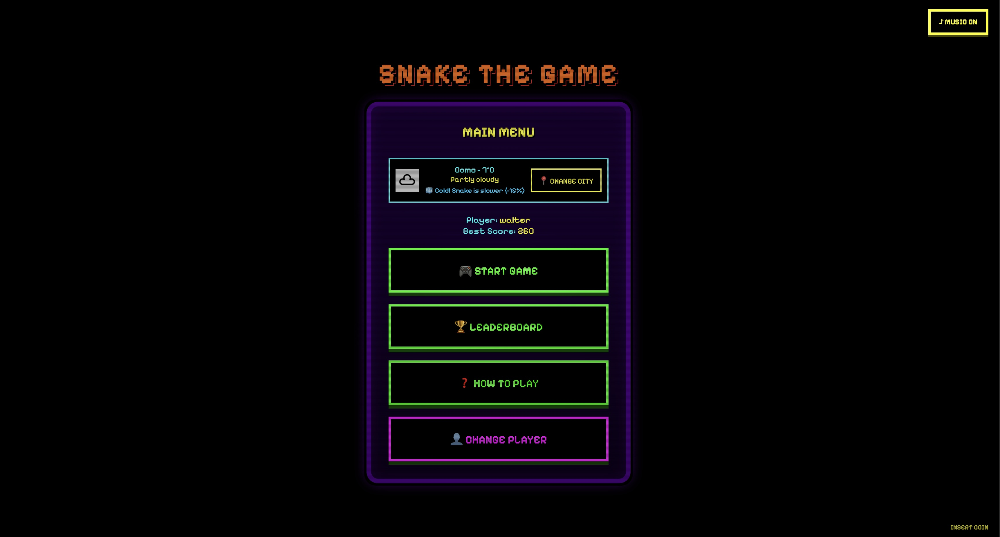
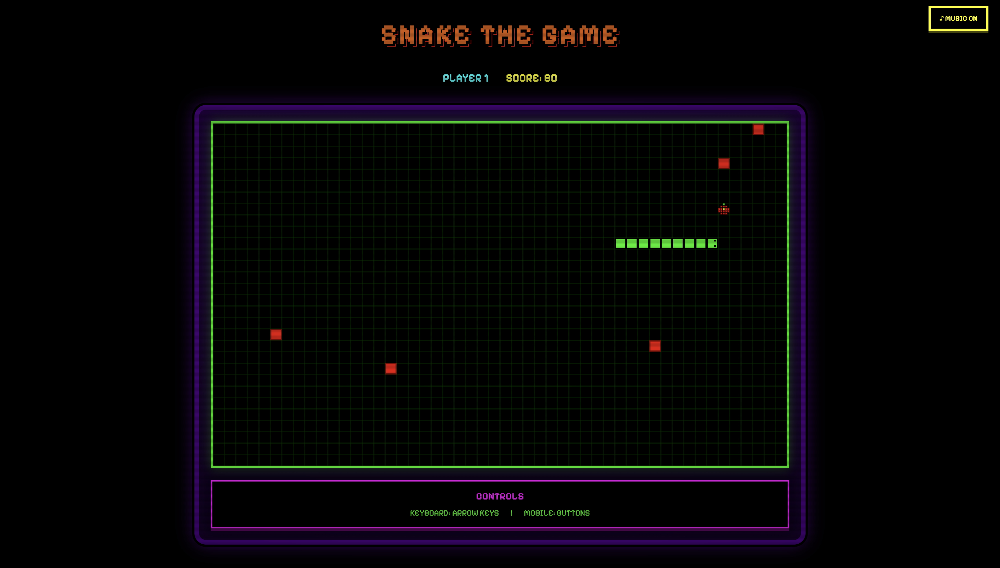
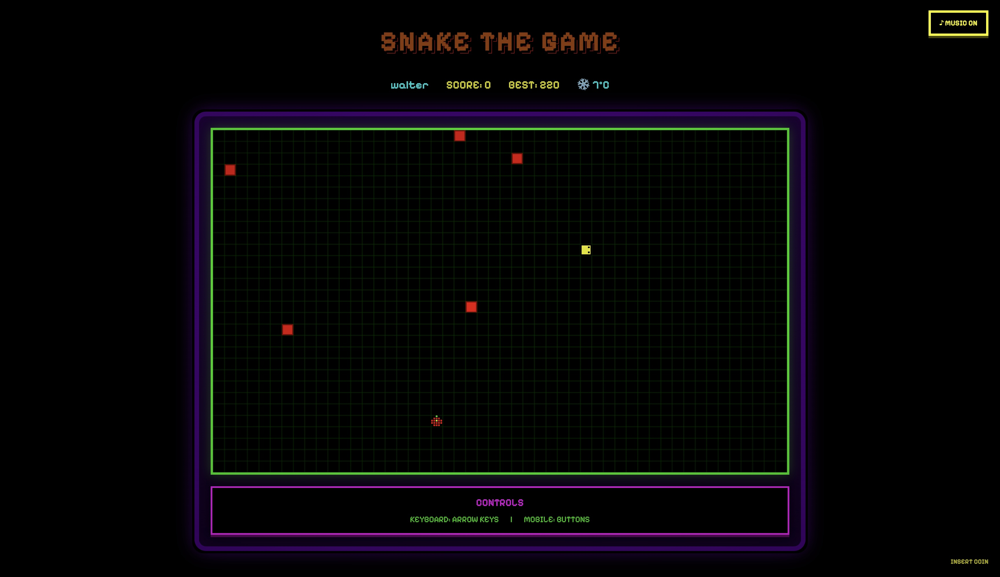
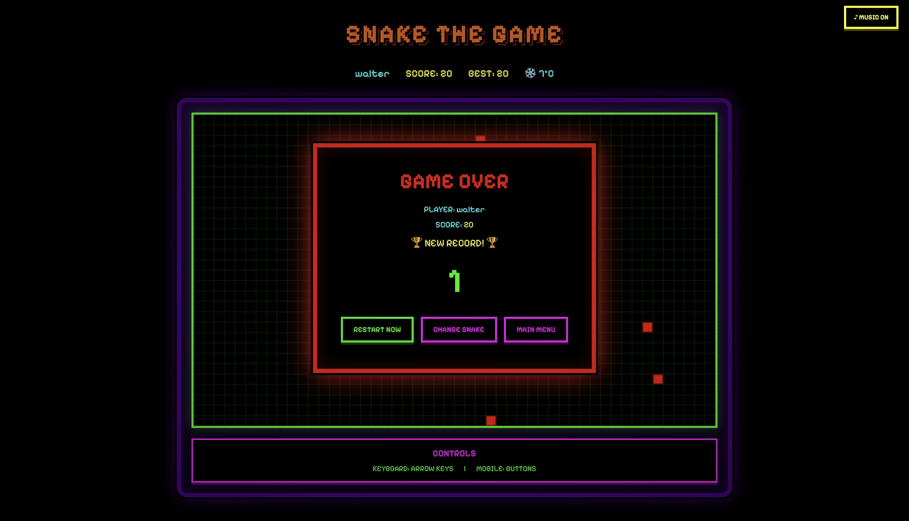
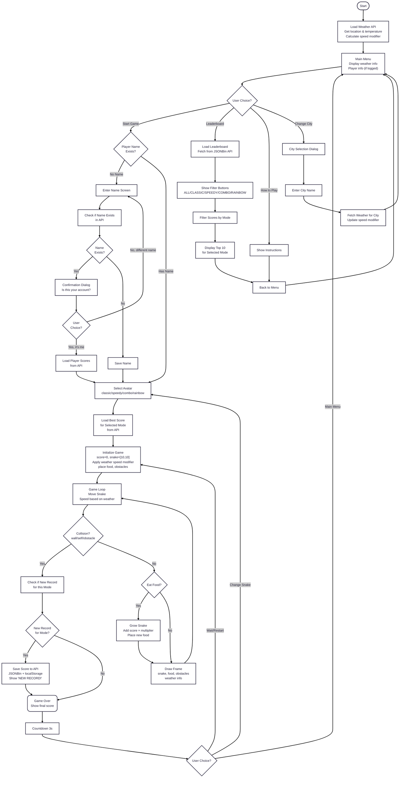

SUPSI 2025-26 
Creative Coding 
Marco Lurati, Giovanni Profeta 
Assignments 03

# Snake The Game
Author: Walter De Nicola 
[Snake The Game](https://walterdn03.github.io/MAInD-Creative-Coding-Foundations-2025/assignments/assignments%2002/) 

## Brief
Upgrade the **Assignment 02** by adding the use of data coming from an external web API. For example, fetch contents (audio, images, video, text, metadata) from online archives, AI generated contents (chatGPT API), data (weather, realtime traffic data, environmental data).

Have a look at the lesson about the API:

[https://wind-submarine-3d4.notion.site/Lesson-5-200d516637bc811aba69e13b0ffe438f?pvs=74](https://www.notion.so/200d516637bc811aba69e13b0ffe438f?pvs=21)

The application **must** have those requirements:

- The webpage is responsive
- Use a web API (you choose which one best fists for your project) to load the data and display them in the webpage
- At least one multimedia file (for user feedback interactions, or content itself)
- Develop a navigation system that allows the user to navigate different sections with related content and functionalities

## Project description
The game is directly inspired by the classic game snake, recreating its arcade-style atmosphere with modern enhancements. Upon starting, players access a main menu displaying real-time weather information via the Weatherstack API, which dynamically affects gameplay by modifying snake speed based on temperature. Players can manually select any city to experience different difficulty levels, with hot weather increasing speed and cold weather slowing it down. 

Before playing, users enter their name, which is verified against an online database through the JSONBin API to maintain persistent profiles. Players then select from four avatars with unique abilities: classic offers standard speed, speedy provides faster movement, combo doubles points, and rainbow features color-shifting visuals. The snake is controlled using arrow keys or on-screen buttons on mobile, with the objective of collecting apples while avoiding obstacles and self-collision.

When the game ends, scores are automatically saved to the cloud if they represent a new personal record for that specific mode. The system compares scores within each avatar type separately, ensuring fair competition. The global leaderboard, accessible from the main menu, displays top ten players with filtering options for each game mode, creating dedicated rankings for every avatar type. All data is stored online using the JSONBin API while maintaining local backups for offline functionality.

## Screenshot

## Flowchart

## Function: Weather & API Functions
### fetchWeather()

**Parameters:** None

**Return:** Promise

**Description:** It attempts to retrieve the user's geolocation. If successful, it queries the Weatherstack API using the coordinates (latitude and longitude). It updates the global weatherData object and calls updateWeatherDisplay(). If it fails, it sets the UI to a default error state.

---

### fetchWeatherByCity()

**Parameters:** None

**Return:** Promise

**Description:** It retrieves the city name entered in the input field. It queries the Weatherstack API with that specific city name. If valid, it updates the weatherData object and the UI, then closes the city selection dialog.

---

### changeCityManually()

**Parameters:** None

**Return:** None

**Description:** It hides the main menu and displays the "City Selection" dialog overlay, setting the focus on the input text field to allow the user to type a city name.

---

### useCurrentLocation()

**Parameters:** None

**Return:** None

**Description:** It closes the city selection dialog, returns to the main menu, and triggers fetchWeather() to attempt to use the browser's geolocation services again.

---

### calculateSpeedModifier(temp)

**Parameters:** temp (Number)

**Return:** Number

**Description:** It calculates a speed multiplier based on the provided temperature. Temperatures above 30°C result in a lower multiplier (faster game), while temperatures below 10°C result in a higher multiplier (slower game).

---

### updateWeatherDisplay()

**Parameters:** None

**Return:** None

**Description:** It updates the HTML DOM elements (icon, city name, temperature, condition text) based on the current weatherData. It also determines and sets the text and color for the "Weather Effect" message (e.g., "HOT! Snake is faster").

---

## Function: Player & Account Management

### startGameFlow()

**Parameters:** None

**Return:** None

**Description:** It checks if a playerName is currently set. If a name exists, it navigates to the Avatar Selection screen. If not, it navigates to the "Enter Name" screen.

---

### updateMenuPlayerInfo()

**Parameters:** None

**Return:** None

**Description:** It toggles the visibility of the player information in the Main Menu. If a player is logged in, it shows their name and best score; otherwise, it shows the generic guest message.

---

### changePlayer()

**Parameters:** None

**Return:** None

**Description:** It resets the playerName, playerBestScore, and clears the data from LocalStorage. It resets the input fields and redirects the user to the "Enter Name" screen.

---

### checkAndSaveName()

**Parameters:** None

**Return:** Promise

**Description:** It reads the name input and calls checkIfNameExists(). If the name is taken and skipConfirmation is false, it asks the user to confirm their identity. If the name is new or confirmed, it proceeds to accept the name.

---

### checkIfNameExists(name)

**Parameters:** name (String)

**Return:** Promise

**Description:** It fetches the latest data from JSONBin and filters the scores to see if the provided name already exists. It returns the highest score for that user if found, or null if the user is new.

---

### confirmYes()

**Parameters:** None

**Return:** Promise

**Description:** It is triggered when a user confirms an existing account. It fetches the score associated with the temporary name and calls acceptName().

---

### confirmNo()

**Parameters:** None

**Return:** None

**Description:** It is triggered when a user denies an existing account. It sets a flag to skip future confirmations, hides the dialog, and returns the focus to the name input field.

---

### acceptName(name, bestScore)

**Parameters:** name (String), bestScore (Number)

**Return:** None

**Description:** It sets the global player variables, saves the name to LocalStorage, updates the UI displays, and navigates the user to the Avatar Selection screen.

---

## Function: Navigation & UI System

### showSection(sectionId)

**Parameters:** sectionId (String)

**Return:** None

**Description:** It manages the visibility of the application's screens. It hides all sections and only displays the DOM element matching the provided sectionId. It also triggers specific initialization logic for the leaderboard or game screen if necessary.

---

### updatePlayerDisplay()

**Parameters:** None

**Return:** None

**Description:** It updates the in-game HUD (Heads Up Display) elements to show the current player's name and their specific best score for the active game mode.

---
## Function: Leaderboard System

### saveScoreAutomatically(finalScore)

**Parameters:** finalScore (Number)

**Return:** Promise

**Description:** It fetches the current leaderboard from the API. It checks if the finalScore is a new personal record for the specific avatar mode being played. If it is, it updates the database via a PUT request. It returns true if a new record was set.

---

### saveToLocalStorage(scoreData)

**Parameters:** scoreData (Object)

**Return:** None

**Description:** It saves the score object into the browser's LocalStorage. This serves as a backup mechanism and ensures offline functionality for score history.

---

### loadLeaderboard()

**Parameters:** None

**Return:** Promise

**Description:** It displays a loading state and attempts to fetch scores from the JSONBin API. If successful, it caches the data and displays it. If the API fails, it falls back to loading scores from LocalStorage.

---

### filterLeaderboard(filter)

**Parameters:** filter (String)

**Return:** None

**Description:** It updates the current leaderboard filter (e.g., 'classic', 'speedy', 'all'). It updates the active button state in the UI and calls displayLeaderboard() with the filtered subset of scores.

---

### displayLeaderboard(scores, isOnline)

**Parameters:** scores (Array), isOnline (Boolean)

**Return:** None

**Description:** It generates the HTML table for the leaderboard. It handles the "No scores" state, assigns medals to the top 3 players, and renders the list of players, scores, and avatar icons.

---

### backToMenu()

**Parameters:** None

**Return:** None

**Description:** It acts as a global reset to return to the Main Menu. It clears game intervals, hides the game screen and overlays, and stops the background music.

---

## Function: Audio

### playBackgroundMusic()

**Parameters:** None

**Return:** None

**Description:** Checks if the global isMusicMuted variable is false. If so, it triggers the backgroundMusic.play() method.

---

### stopBackgroundMusic()

**Parameters:** None

**Return:** None

**Description:** Pauses the background music audio object and resets its currentTime property to 0, ensuring the track starts from the beginning next time.

---

### toggleMusic()

**Parameters:** None

**Return:** None

**Description:** Toggles the isMusicMuted boolean state. It updates the DOM element (the music toggle button) text and CSS class. Depending on the new state, it calls either stopBackgroundMusic() or playBackgroundMusic() (if a game is active).

---

### playEatSound()

**Parameters:** None

**Return:** None

**Description:** Resets the eatSound audio time to 0 and plays the sound effect. Called when the snake consumes food.

---

### playGameOverSound()

**Parameters:** None

**Return:** None

**Description:** Resets the gameOverSound audio time to 0 and plays the sound effect. Called when the game ends.

---

## Function: Game logic

### selectAvatar(avatarType)

**Parameters:** avatarType (String)

**Return:** None

**Description:** Sets the selectedAvatar variable based on user input. It updates the UI to highlight the chosen avatar card, hides the selection screen, shows the game screen, and calls startGame().

---

### loadBestScoreForMode(mode)

**Parameters:** mode (String)

**Return:** Promise

**Description:** It fetches the latest scores and filters them to find the logged-in player's highest score specifically for the selected avatar mode. It updates the playerBestScoreThisMode variable.

---

### generateObstacles()

**Parameters:** None

**Return:** None

**Description:** Clears the obstacles array and generates random coordinates for a set number of obstacles (OBSTACLE_COUNT). It ensures obstacles are not placed too close to the snake's starting position or on top of existing obstacles.

---

### startGame()

**Parameters:** None

**Return:** None

**Description:** Initializes game variables (snake position, velocity, score, time). Calls functions to generate obstacles and place food. Clears any existing game loop and starts a new interval (gameLoop) based on the selected avatar's speed.

---

### update()

**Parameters:** None

**Return:** None

**Description:** The main game loop function. It calls moveSnake(), checks for collisions (triggering gameOver() if true), checks for food consumption (triggering eatFood() if true), increments the animation frame, and calls draw() to render the scene.

---

### moveSnake()

**Parameters:** None

**Return:** None

**Description:** Calculates the new coordinates for the snake's head based on current velocity. It adds the new head to the start of the snake array and removes the last segment (tail), simulating movement.

---

### checkCollision()

**Parameters:** None

**Return:** Boolean

**Description:** Checks three conditions: if the snake hits the canvas walls, if the snake hits its own body, or if the snake hits an obstacle. Returns true if any collision occurs, otherwise false.

---

### checkFoodCollision()

**Parameters:** None

**Return:** Boolean

**Description:** Compares the coordinates of the snake's head with the coordinates of the food. Returns true if they match.

---

### eatFood()

**Parameters:** None

**Return:** None

**Description:** Increases the score based on the avatar's multiplier. Extends the snake by duplicating the tail segment. Calls placeFood() to spawn a new apple, updates the score display, and plays the eating sound.

---

### placeFood()

**Parameters:** None

**Return:** None

**Description:** Generates random coordinates for the food. It loops continuously until it finds a position that does not overlap with the snake's body or any obstacles.

---

### draw()

**Parameters:** None

**Return:** None

**Description:** Renders the entire game state to the canvas. It draws the black background, the green grid lines, the red obstacles, the snake (handling special colors like "rainbow" and eye direction), and the pixel-art apple with a pulsing animation.

---

### updateScore()

**Parameters:** None

**Return:** None

**Description:** Updates the text content of the HTML element with the ID score to reflect the current score variable.

---

### gameOver()

**Parameters:** None

**Return:** None

**Description:** Clears the game loop interval, stops the music, and plays the game over sound. It displays the game over overlay with the final score and initiates the restart countdown.

---

### startCountdown()

**Parameters:** None

**Return:** None

**Description:** Sets an interval to countdown from 3 to 0. Updates the countdown display every second. When it reaches 0, it resets the game state and calls startGame().

---

### skipCountdown()

**Parameters:** None

**Return:** None

**Description:** Immediately clears the countdown interval, hides the game over overlay, resets the score, and calls startGame() without waiting.

---

### changeAvatar()

**Parameters:** None

**Return:** None

**Description:** Clears any active countdowns, hides the game screen and game over overlay, and displays the avatar selection screen. Resets the selectedAvatar to null and stops the music.

---

### changeDirection(direction)

**Parameters:** direction (String)

**Return:** None

**Description:** Updates the velocityX and velocityY variables based on the input string ('UP', 'DOWN', 'LEFT', 'RIGHT'). It includes logic to prevent the snake from reversing directly into itself (e.g., cannot go DOWN if currently going UP).

---

### resizeCanvas()

**Parameters:** None

**Return:** None

**Description:** Calculates the optimal width and height for the canvas based on the window size to ensure the game fits on screen. Updates the CSS width and height of the canvas element.

 

## Content and data source

[Snake the game font](https://fonts.google.com/specimen/Pixelify+Sans)

[Eat sound](https://www.youtube.com/watch?v=Ia8TzPJzSX8)

[Soundtrack](https://www.youtube.com/watch?v=FpDWpX9luCQ)

[Game over sound](https://www.youtube.com/watch?v=FVJJKIJWKdc)

